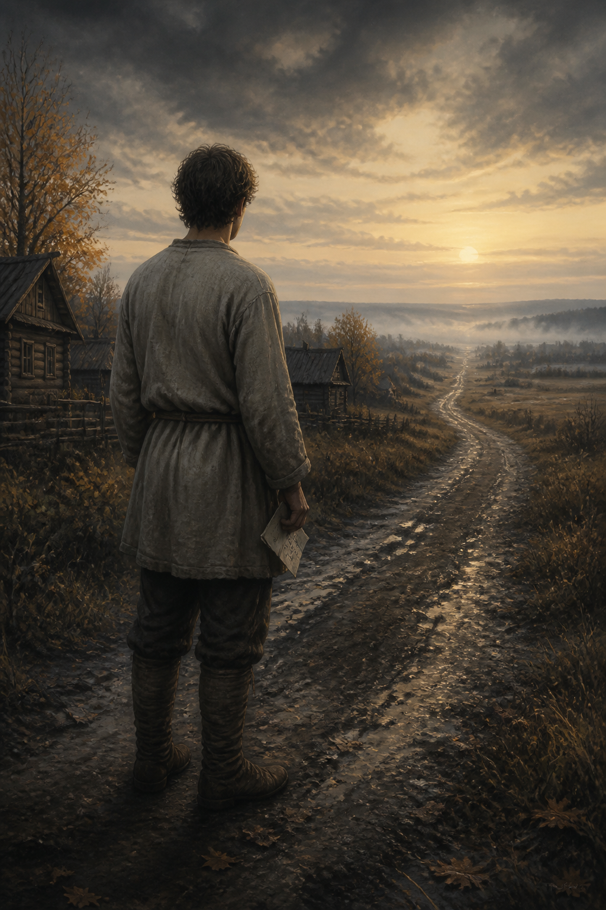
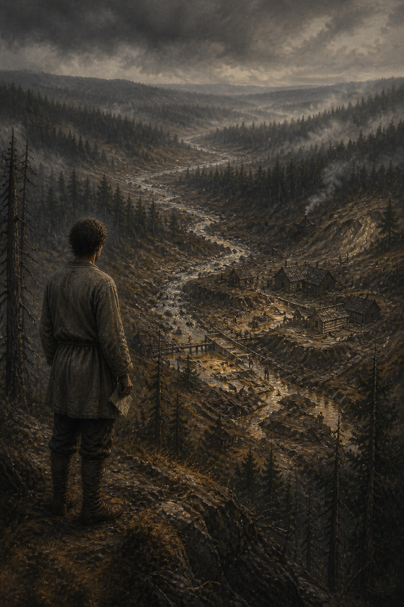
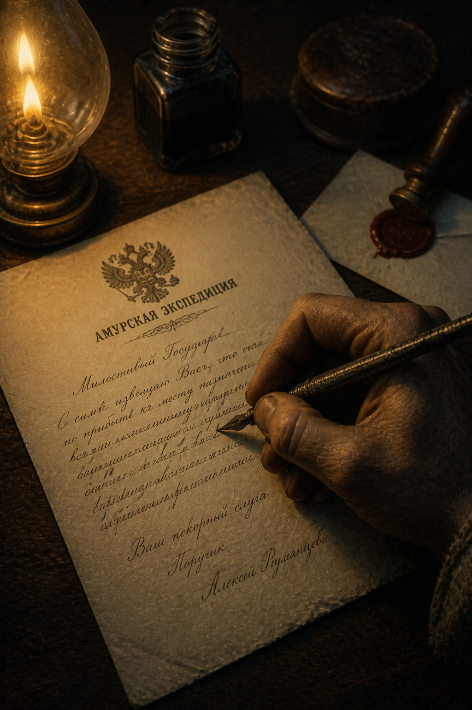
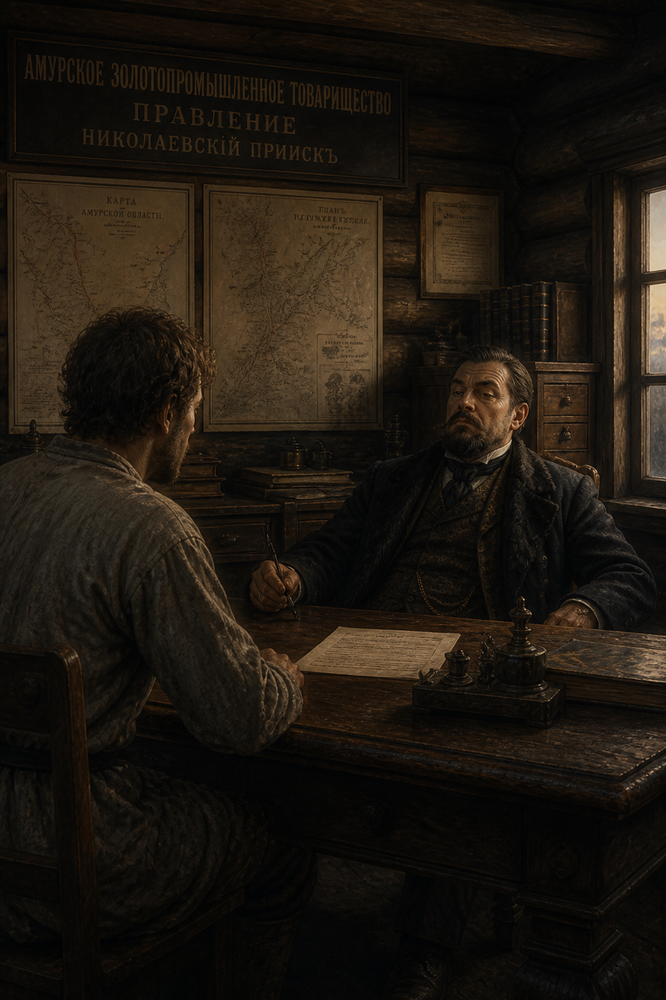
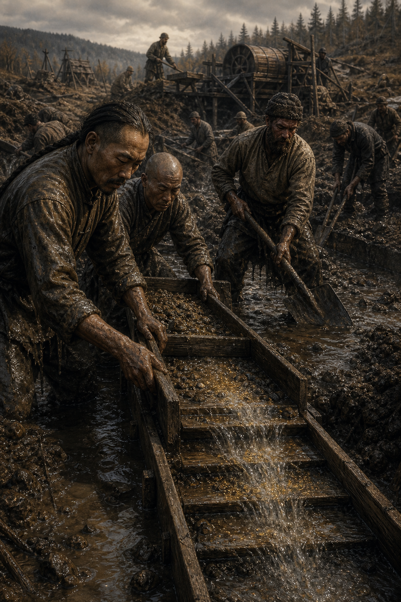
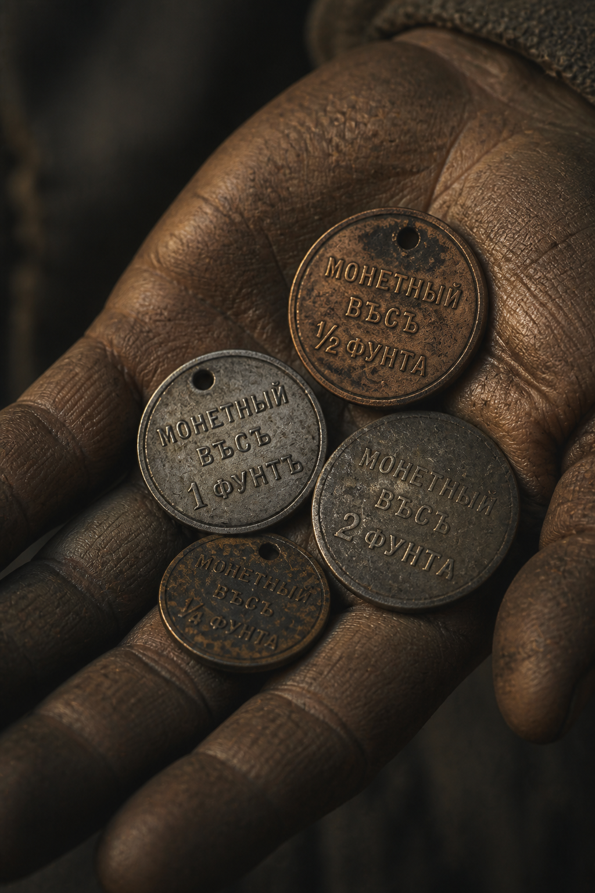
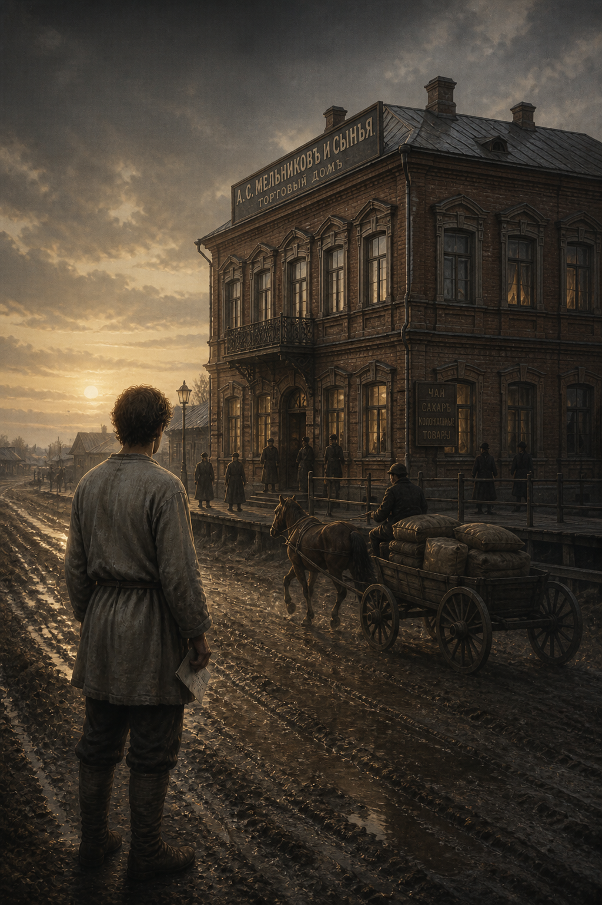
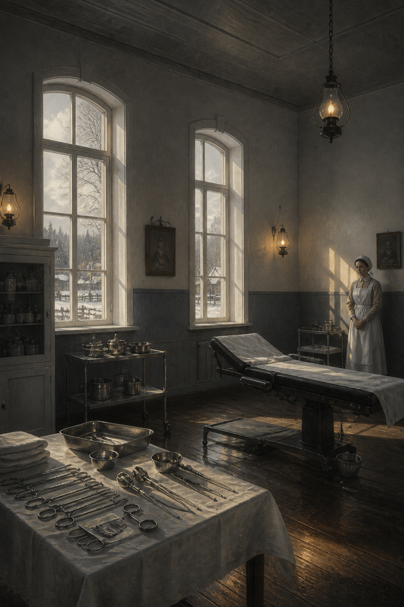
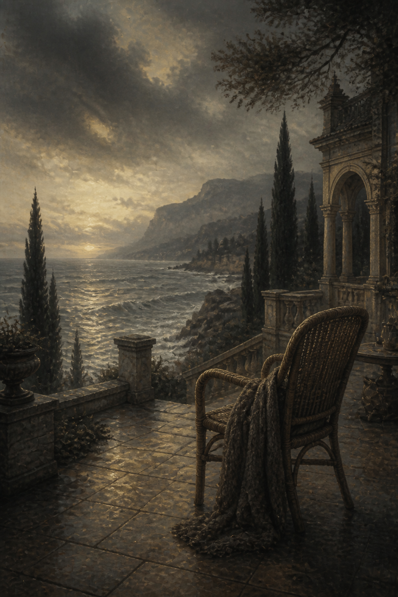
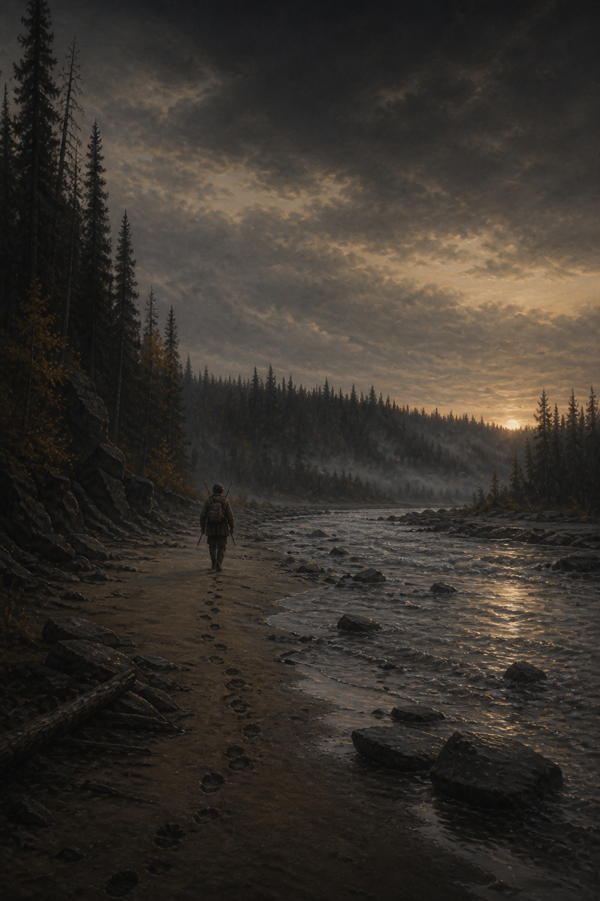

# Купец Ларин — Цикл исторических иллюстраций

Полная серия из 10 кинематографических иллюстраций по мотивам исторической хроники купца Ларина (Дальний Восток, XIX–XX вв.).

## Единый визуальный стиль
- **Стиль**: Кинематографическая историческая живопись / цифровой арт
- **Палитра**: Приглушенная сепия, холодный шифер/графит с теплыми золотыми акцентами
- **Освещение**: Драматичный low-key свет, зернистая пленочная текстура
- **Атмосфера**: Историческая таинственность, суровость дальневосточной тайги

---

### 1. Уход. 1874 год
> *Двадцатитрёхлетний крестьянин получает паспорт и уходит за шесть тысяч вёрст.*

---

### 2. Тайга. Прииски на Джалинде
> *Куда он приехал: глухая тайга у китайской границы.*

---

### 3. Прошение императору
> *Через полтора года он пишет прошение Александру II — просит записать его в купцы.*

---

### 4. Договор. 12 августа 1887 года
> *Компания объявляет свой лучший прииск выработанным и сдаёт его Ларину в аренду.*

---

### 5. Золото. Промывка
> *На «выработанном» прииске он добудет ещё две тонны золота.*

---

### 6. «Хлебные деньги»
> *Он платил рабочим собственными жетонами: вместо рублей — «20 фунтов хлеба».*

---

### 7. Дом в Благовещенске
> *Купеческий особняк, в котором сегодня сидит городская администрация.*

---

### 8. Дар городу. 1905 год
> *Он построил и подарил городу целый хирургический корпус.*

---

### 9. Ялта. Декабрь 1915 года
> *Он умер не в тайге, а на своей вилле у Чёрного моря.*

---

### 10. Обрыв следа. 1934 год
> *Его младшего сына в последний раз видели уходящим в тайгу. Дальше — ничего.*

